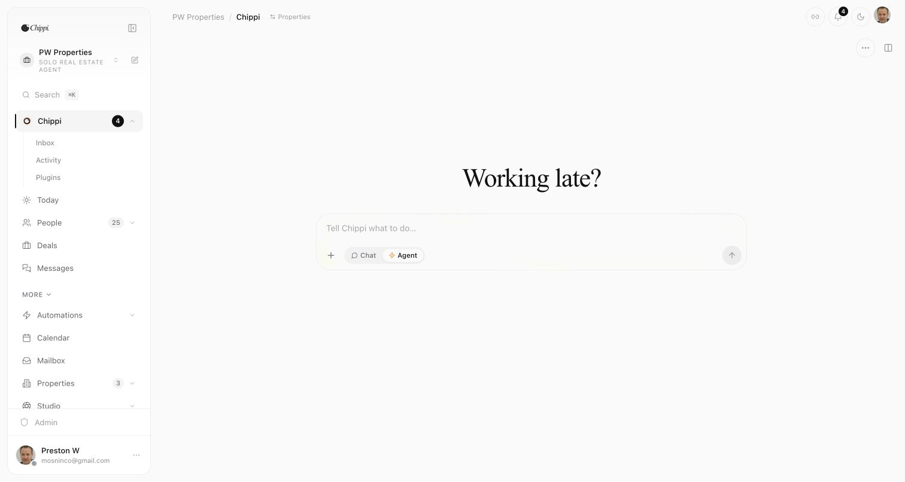
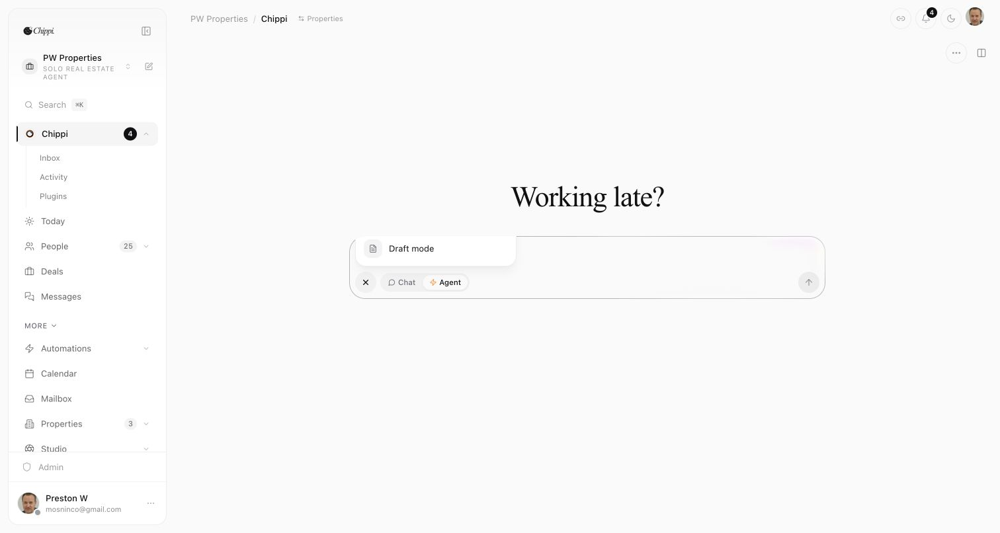

# Chippi Composer Draft Mode Removal

Date: 2026-07-29  
Baseline commit: `4bc1f92a`  
Status: locally accepted; not deployed

## Outcome

The customer-facing **Draft mode** option has been removed from the Chippi
composer. Its local state, alternate placeholder, menu checkbox, and
`[Draft: ...]` prompt wrapper are gone. Messages now flow through the explicit
Chat or Agent runtime selected by the user.

Realtime Voice Delegation remains wired through `onVoiceStart`. This change
does not alter the voice dialog, Realtime session gateway, Work Session engine,
or conversation-linked work cards.

## Product evidence

The authenticated production baseline showed Draft mode as a fifth item in the
composer's More actions menu:

The source trace established that the mode had no API property, database state,
environment flag, or durable policy. It only transformed local composer text
into `[Draft: <message>]`, which then traveled as an ordinary message.

## Preserved safety systems

The removal deliberately preserves the real approval infrastructure:

- workflow autonomy values and per-workflow approval policy;
- the approval inbox and persisted message proposals;
- pending-approval overload guardrails;
- test-run behavior that prevents real sends;
- historical messages whose text already contains a Draft prefix.

Workflow education now says **Approval-first by default**, and the unconfigured
send error directs users to save a message for approval instead of referring to
a nonexistent mode.

## Verification

- 28 focused tests passed across removal, composer hydration, routing, Realtime
  Voice Delegation, and voice session configuration.
- Full Vitest regression: 543 files passed; 4,968 tests passed; 1 skipped.
- TypeScript `tsc --noEmit`: passed.
- ESLint on the changed TypeScript files: passed.
- `git diff --check`: passed.

The first package-manager wrapper attempt stopped at a local ignored-build
policy check before executing tests. Verification was rerun through the
repository's existing binaries and completed successfully.

## Evidence boundary

This is verified source and local-test evidence. Production still displays the
old menu because no deployment was requested or performed. Paying-customer
behavior has not been changed.
