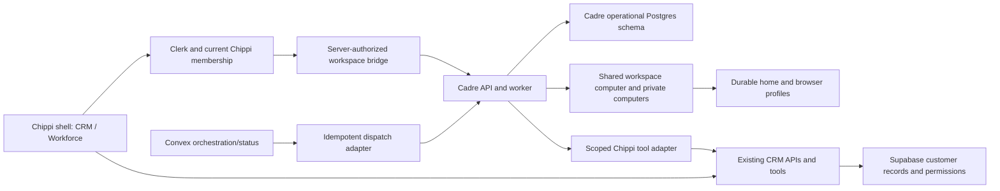

# Chippi workforce: source import and integration design

Status: the complete source is retained in a pinned fork. The authenticated
client mount, signed identity bridge, protected Chippi, native CRM queries,
workspace switching, and execution reauthorization are implemented locally.
The runtime has not been provisioned for customers. Full provider parity is
still an acceptance requirement; see [implementation and remaining gates](workforce-implementation.md).

## Source and live evidence

- Source: `https://github.com/mosnin/cadre`, forked from `elie222/rakazo`.
- Pinned revision: `e7c7fbf68d15dcd2f144591a81ce4db40b96f0b3`.
- Exact source tree: `71bb9a12cadbfa63dffc4d123cabe406cf999e4d`.
- All 1,209 tracked files are available in `integrations/cadre`, including
  clients, runtime, contracts, adapters, infrastructure, tests and license.
- Live browser inspection reached the authenticated Cadre application through
  its existing session. Observed agent threads, group conversations, integration
  entry point, agent settings, and computer entry point. No task was submitted,
  integration authorized, agent changed, or computer controlled during this audit.
- Vercel reported the Cadre web deployment
  `dpl_5rtRLx7oPpeHe9C7W4CuR9L8isgK` Ready at `www.cadre.to`. This does not prove
  the API/worker/provider revision or a newly exercised end-to-end task.
- Cadre's README includes capabilities that may be optional or disabled in the
  current hosted experience. Source preservation and live acceptance are tracked
  separately below; neither marketing nor existing chat text proves execution.
- Import verification: the initialized submodule is clean and matches the exact
  pinned tree. Chippi TypeScript and lint passed (lint retains existing warnings);
  6,642 tests passed and 7 were skipped across 765 test files. These checks verify
  that the independent source import does not break Chippi's checks. Cadre's own
  tests, a combined build, and provider acceptance have not been run for this import.

## Product decision: two views of the same business

Keep the current CRM and add a Workforce view. Keep a single workspace selector
above the view toggle. Selecting a view changes the working surface; selecting a
workspace changes the data and authority. Never combine these into one menu.

```text
Workspace name                         [switch workspace]
Your role

[ CRM ] [ Workforce ]

CRM                            Workforce
Current CRM navigation         Chippi                 pinned
                               Work                   active / needs you / done
                               Specialists            created when needed
                               Computer               opens side panel

                               Connections / settings in existing account area
```

Use the actual Cadre chat, composer, activity, agent, group and computer surfaces.
Adapt its shell to the shared Chippi navigation and brand tokens. Avoid a second
sidebar inside the first, a second sign-in, or an iframe pointed at cadre.to.
Keep Cadre's advanced settings available in contextual panels. Provider names,
machine settings and model configuration should not be first-run prerequisites.

The default Workforce screen is Chippi's thread. A user can ask for an outcome,
see the work underway, intervene or stop it, and receive the result in the same
thread. Worker details and the live computer open alongside that conversation.
On mobile, use one full-screen detail panel with a clear return to the thread.

Persist the last useful location per actor, workspace and view. A view switch
must not restart a job, swap workspaces, discard a draft, reset scroll, or trigger
the existing blocking account-switch splash. Active work stays visible and
stoppable in both views. On workspace change, discard old privileged caches,
subscriptions and screen grants before showing the new workspace.

The signed-out website remains outside the integration. Existing CRM features,
routes, stored conversations, customers and integrations remain available.

## What Chippi actually does for real estate customers

Start with a single request such as: "Work today's new leads, arrange showings,
and flag anything that needs me." Chippi selects existing workflows and calls
specialists only when the work benefits from separate execution.

| Specialist | Concrete work | Where results belong |
| --- | --- | --- |
| Lead follow-up | Respond within configured policy, qualify, schedule, revive stale leads | Existing contact, activity, appointment and delivery records |
| Transaction coordination | Track deadlines, request missing documents, follow up with participants | Existing deal, tasks, files and exception queue |
| Listing operations | Assemble listing material, coordinate preparation, update authorized portals | Existing property, files and publishing receipts |
| Brokerage operations | Check routing/SLA exceptions, workload and missing follow-up | Scoped brokerage assignment and exception records |
| Research / administration | Research vendors, organize files, perform authorized web tasks | Linked task result and source artifacts |

These are useful defaults and instructions on the imported runtime, not new
independent agents with duplicated databases. Users can add custom workers and
access the rest of Cadre's features. Routine work executes within saved autonomy
settings. Requests for human input are for actual missing authority, protected
input or an operational exception; drafting is not the default definition of done.

## Architecture: preserve Cadre's working runtime



Cadre's React/Vite client and Hono/oRPC API cannot be copied into Next.js routes
unchanged and automatically work. Preserve its package boundaries, bundle its
client independently, and mount it through a reviewed same-origin route adapter
under `/workforce`. Retain deep links and streaming/viewer routes. A narrow host
adapter supplies workspace, branding, return navigation and session state. The
current CRM remains a separate view within the same product.

Clerk and Chippi's Supabase memberships remain the customer authority. Add a
server-authenticated session exchange that binds actor, canonical scope,
membership version, role and expiry to the Cadre runtime. Browser-supplied role
or workspace IDs never authorize access. Verify current membership before
issuing the exchange and at execution boundaries; fail closed when unavailable.
Use a nonce/expiry to prevent replay, audience-bound credentials, and separate
web session and worker capabilities. Do not copy Clerk secrets or customer
provider credentials into a computer, and do not reuse the Cadre production DB.

Keep Cadre's Prisma/Graphile execution state on dedicated operational Postgres
(a dedicated database initially; co-location with Supabase requires explicit
schema and migration compatibility verification). Supabase remains the CRM
system of record. The scoped Chippi adapter uses existing business tools,
delivery idempotency, permissions and usage accounting rather than creating a
second email/lead/deal implementation. Existing customer connections stay where
they are; expose authorized tools to Cadre instead of copying provider tokens.

Convex coordinates Chippi dispatch and displays status; Cadre's worker owns the
imported run lifecycle, leases, cancellation and checkpointing. Assign a single
scheduler owner for each routine. A Chippi-managed routine cannot also be enabled
as an independent Cadre routine. Use stable dispatch IDs, receipt reconciliation,
and the existing uncertain-outcome rules to avoid duplicate external actions.
Do not migrate Cadre's entire working queue to Convex as part of this import.

## Persistent computers and roles

The source implements one Team Computer per Cadre space (`team:<spaceId>`),
private computers, fenced per-bot execution leases and separate graphical
screens. The shared-computer architecture also synchronizes supported cookies
and local storage across browser profiles. Files, tools and transferable login
state are shared; bot folders and separate screens do not enforce permissions.

That makes one computer for every brokerage user unsafe as a default product
mapping. Sharing must follow a common authority boundary, not merely an org ID.

| Chippi scope | Computer/workforce scope | Authority |
| --- | --- | --- |
| Personal agent | Personal workspace computer, shared by that agent's authorized AI workers | Personal CRM grants and integrations |
| Team | Team-owned workforce/computer only after explicit team membership exists | Team resources; no brokerage admin sessions |
| Brokerage operations | Organization-owned workforce and computer | Authorized operations staff and service capabilities |
| Privileged/private work | Separate private computer and credentials | Explicitly restricted actor/workflow |

The previous audit found no distinct Chippi team hierarchy. Do not invent one
from the `team` billing plan. Resolve that scope before exposing a team-wide VM.
Likewise, Cadre's bots are currently filtered by both `spaceId` and `userId` in
`packages/db/src/repos.ts`; sharing an organization does not automatically make
a worker jointly manageable. Add explicit workforce ownership and role grants,
not the brokerage owner's personal identity masquerading as every user.

Durability means files and supported browser profiles survive machine recovery.
Cadre's documented Modal path uses durable home checkpoints plus optional native
filesystem snapshots. Running processes, TCP connections and open windows do
not survive that restart contract. Show reconnecting/restoring honestly. Keep
provider capability checks, takeover leases, private-computer mode and screen
isolation. Do not promise identical persistence semantics for every adapter.

## Chippi is the permanent orchestrator

Create exactly one system Chippi per authorized workforce scope, atomically at
provisioning, with a database uniqueness constraint and stable system identity.
The display name is always **Chippi**. The identity must not depend on the name.

Required backend changes in the imported runtime:

- A reserved system role and tenant-scoped unique orchestrator record.
- Reject rename, delete, archive, replacement, system-role mutation and bulk
  operations affecting Chippi in all API, tool and repository paths.
- A specialist cannot promote itself to Chippi, create another system Chippi,
  or obtain broader permissions by delegating. Delegation intersects grants and
  propagates actor, scope, budget, deadline and cancellation.
- Chippi remains pinned and recoverable after worker restart or reassignment.
  Organization-owned orchestration must survive an individual owner leaving.
- Stop, pause, steer, and revoke tools still work. Nondeletable never means
  unstoppable. Workspace/account deletion follows the product's normal deletion
  lifecycle and is distinct from deleting an agent.
- Chippi owns the user-facing parent task. Specialist replies attach to it;
  delegated work must not require the user to initialize a second conversation.

Cadre currently exposes ordinary `bots.archive` and `bots.remove` without this
system-agent distinction. Hiding a menu item or naming a normal bot Chippi would
not fulfill this requirement.

## Full-source parity inventory

All source is preserved. The following surfaces must be exercised before claiming
that all functionality is available inside Chippi. Paths are relative to
`integrations/cadre`. "Retain" means an integration requirement, not a passed test.

| Capability | Existing source | Chippi treatment / acceptance |
| --- | --- | --- |
| Threads, composer, attachments, streamed activity | `apps/web/src/pages/Shell.tsx`, `packages/chat-ui`, contracts `threads` | Retain actual UI; one final answer; draft and scroll continuity |
| Persistent bots, groups, sections and search | contracts `bots`, `groups`, `botSections`, `search`; `packages/db/src/repos.ts` | Retain management for specialists; enforce system Chippi exceptions |
| Peer messages, handoffs, subagents | `packages/core/src/bot-messages.ts`, `packages/adapters/src/pi-runtime.ts` | Return results to the parent; stop/steer propagation; bounded grants |
| Run lifecycle, retry, cancellation and external effects | `apps/worker`, schema `Run`, `Attempt`, `ExternalEffect` | Preserve queue semantics; test duplicate dispatch and worker death |
| Shared/private computers and takeover | `packages/db/src/computers.ts`, contracts `computer`, `docs/computer-runtime.md` | Persist tenant-scoped workspace; test concurrent screens and human takeover |
| Files, browser state and restore | `AgentHomeStore` adapters, `docs/architecture/shared-computer-sessions.md` | Verify checkpoint, destruction/recovery and supported login continuity |
| Provider choice | `packages/adapters/src/*-sandbox.ts`, `infra/` | Preserve all adapters; activate managed provider only after live canary |
| Memory, revisions, scratchpad and skills | contracts `memory`, `scratchpad`, `skills`, `agentSkills` | Retain in contextual panels with scoped ownership |
| Routines and scheduling | contracts `routines`, `apps/worker` | Retain; one scheduler owner per business routine |
| Models and reasoning settings | contracts `models`, Pi adapters | Managed OpenRouter default; optional advanced controls; unify cost ledger |
| Connections, Composio, Pipedream, MCP/OpenAPI/Treg | contracts `connections`, `capabilities`, `mcp`; adapters | Preserve source and options; reuse existing Chippi connections through scoped tools |
| Messaging channels and webhooks | contracts `messaging`, API messaging routes | Retain behind explicit grants; avoid duplicate CRM provider deliveries |
| Approval rules and automatic review | contracts `approvalRules`, `autoReview` | Reconcile with saved Chippi autonomy policy; explain actual exceptions |
| Artifacts, usage, export and notifications | corresponding RPC contracts | Link outputs to CRM records; one billable usage event per execution |
| Voice and dictation | contracts `voice`, web voice components and adapters | Preserve code; capability-gated acceptance, not an assumption from README |
| Company OS workforce protocol and OAuth | `apps/api/src/workforce.ts`, `packages/auth`, `docs/cloud-workforce.md` | Preserve optional integration; no Company OS prerequisite for Chippi |
| Deployment/updater/preferences/onboarding | RPC contracts and `infra/` | Operator-only deployment controls; managed Chippi first-run flow |
| Desktop and mobile | `apps/desktop`, `apps/mobile`, shared packages | Preserve full source; reconcile existing Chippi Mac shell and navigation before packaging |
| Marketing and self-hosting | `apps/www`, `docs/`, compose and release infra | Preserve source; do not replace Chippi's logged-out website |

## Build sequence and acceptance

This is one integrated delivery with dependency checkpoints, not a replacement
of the product with a reduced demo. Do not expose a Workforce toggle whose
destination only contains mocked workers or a second login.

1. **Source and baseline:** pin the complete source (done); restore the Chippi
   preview path and verify required existing migrations. Run Cadre's independent
   checks against the pinned revision before changing runtime code.
2. **Authority and runtime:** implement canonical workspace selection, current
   membership checks, session exchange, operational DB, scoped CRM tools, system
   Chippi identity, and one scheduler owner. Test offboarding mid-run and session
   changes before issuing real VM/provider capabilities.
3. **Working vertical flow:** Chippi delegates a synthetic real-estate task to
   two specialists, both use the same computer on separate screens, exchange a
   shared file, and return linked outputs to one parent task. Verify actual tool
   and file results, not a model's assertion that work finished.
4. **Dashboard integration:** mount the original Cadre UI through the host
   adapter, add CRM/Workforce toggle, scope-aware restoration and the computer
   side panel. Carry every parity row through to its visible or contextual entry.
5. **Provider and recovery acceptance:** leave the page, restart the worker,
   stop/steer work, force machine replacement, restore a synthetic file/browser
   fixture, verify no duplicate CRM effects, and exercise takeover expiry.
6. **Role and release acceptance:** test personal/member/admin/owner sessions
   across two organizations, prohibited Chippi mutations, budget exhaustion,
   membership revocation, desktop/mobile switching, and disconnected providers.
   Release the tested revision with rollback to CRM; work must remain stoppable.

Success is a real customer outcome recorded in the existing CRM, with durable
execution and visible exceptions. VM availability or an agent's text reply alone
does not establish that result.
