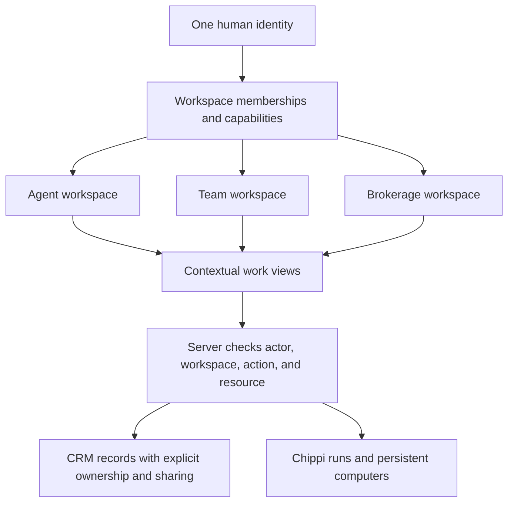

# One Chippi, named workspaces

Decision date: September 8, 2026. Audience: product, engineering, and design.

## Recommendation

Use one signed-in identity with named Agent, Team, and Brokerage workspaces. Keep the workspace selector in the same prominent place. Show the workspace name, its type, and the person's role. A selling broker can own a personal business, join several teams, and administer a brokerage without pretending to become a different person.

Separate three questions: **Where am I working? What am I doing? What may I do?** Workspace, view, and permission answer these independently. Changing the workspace must never grant a role or silently transfer records. CRM and Workforce are views within an authorized context; Chippi agents retain that context when they work in the background.

This is a design and engineering recommendation, not demonstrated churn reduction. The research retained eleven official documentation pages, exact evidence spans, discovery receipts, and a governed packet. Independent review identified evidence limitations; precise document observation dates are unknown and some discovery screening is coarse. Treat the result as a supported direction to test, not a validated optimum.

## What the evidence supports

Linear recommends an organization workspace containing multiple teams; separate workspaces also separate their member lists and billing. That supports a common organizational home rather than separate logins for each job. It does **not** imply every real-estate team should share brokerage records. [Linear workspaces](https://linear.app/docs/workspaces)

Linear distinguishes following a team in navigation from access to public team work. Notion exposes open, closed, and private teamspaces with different discovery/joining behavior. Therefore, team membership, navigation preference, and data access should be modeled separately. We should not copy an open-by-default team policy into a CRM containing private clients. [Linear teams](https://linear.app/docs/teams), [Notion teamspaces](https://www.notion.com/help/browse-join-and-create-teamspaces)

Slack uses a named workspace switcher, and Notion places its workspace switcher in the sidebar. These establish familiar navigation conventions, not experimental evidence that this placement improves Chippi's task times. [Slack switching](https://slack.com/help/articles/1500002200741-Switch-between-workspaces), [Notion workspaces](https://www.notion.com/help/intro-to-workspaces)

Follow Up Boss differentiates personal, team, and account-level access to deals, tasks, reports, and inboxes. The useful pattern is changing the scope of familiar work while reserving administration for authorized people. Its specific predefined roles are not a requirement for Chippi. [Follow Up Boss roles](https://help.followupboss.com/hc/en-us/articles/4402370636567-Users-Roles-Permissions)

Lofty distinguishes lead ownership, assigned responsibility, and visibility, with company, team, and personal ownership and configurable exceptions. This is particularly relevant to agents who bring their own book of business and brokerages that buy and distribute leads. Chippi needs an explicit ownership/sharing policy; making a brokerage visually sit above an agent cannot itself authorize access to that agent's private clients. [Lofty lead ownership](https://help.lofty.com/hc/en-us/articles/115003544406-Lead-Ownership)

Lofty's permission profiles also distinguish company-wide and office/group management. Its configurable permissions illustrate why a single universal “Admin mode” is insufficient for multi-team brokerages. [Lofty permission profiles](https://help.lofty.com/hc/en-us/articles/4407530443291-Organization-Permission-Profiles)

## Dashboard responsibilities

| Context | First question to answer | Primary work | Management, shown when permitted |
| --- | --- | --- | --- |
| Agent | Who needs me next, and which deal is at risk? | Today, People, Deals, Calendar, Messages | Personal connections, preferences, billing |
| Team | What needs an owner, coverage, or a handoff? | Shared work, assignments, conversations, files, Chippi agent team | Membership, shared connections, team routines |
| Brokerage | Where is production or follow-through breaking down? | Lead distribution, pipeline, exceptions, agent performance | Routing, member access, review policies, usage and billing |

Keep common object names stable. “People” should not mean employees in one workspace and clients in another; use “Members” or “Real estate agents” for the roster. A brokerage agent should see assigned work rather than the owner's financial console. An admin's selling activity remains in the agent workspace. These are proposed product responsibilities; this change does not manufacture team CRM data or a new roll-up dashboard.

## Navigation and switching

The selector groups actual memberships under Agent workspace, Teams, and Brokerages. It includes search, marks the exact current context, and labels roles independently. Team creation leads to team setup; brokerage creation leads to brokerage setup. Management destinations stay distinct from productive work.

On a workspace change, preserve the *section* only when an authorized counterpart exists. People can lead to People; a particular person's record, saved filters, identifiers, and query parameters must not follow. Unsupported sections fall back to the destination's starting page. A normal document navigation remounts the current tab's application state. This is an engineering safeguard, not evidence that unsaved drafts or other tabs are safe.

Switching between CRM and Workforce within one workspace is different: returning to the same workspace may preserve its last view. That requires workspace-keyed state and does not justify copying state into another workspace.

## Architecture

Use a workspace type as a product boundary, a membership as the actor's authority, and explicit record grants for shared CRM work. Sponsorship determines entitlement; it is not ownership of every resource. Keep Supabase authoritative for CRM and membership while retaining the existing Cadre operational runtime. No database migration to a different vendor is needed to correct this UX.

The longer-term canonical URL should carry workspace identity, including brokerage identity, so the server and every query can bind an immutable context. Chippi's legacy brokerage routes still select a brokerage using an account cookie. Full navigation improves current-tab remounting but cannot eliminate the risk of another tab changing that cookie. Completing explicit brokerage URL/request scoping is a necessary follow-up before claiming multi-tab isolation.

Background jobs must retain initiating human, workspace, resource grants, and billing account; membership changes must be rechecked before execution. A visible workspace selector cannot substitute for those checks.

## Alternatives and tradeoffs

Three separate products or logins make authority explicit but duplicate navigation and burden people with multiple responsibilities. One blended dashboard avoids switching but obscures record ownership and invites accidental actions in the wrong context. A role toggle is fast but wrongly treats agent/team/brokerage as mutually exclusive identities. The chosen workspace model preserves clear boundaries with one shared navigation system.

A completely open collaboration model would reduce invitation friction, but public-team behavior from project-management products is counterevidence rather than a safe CRM default. Explicit private-data sharing is more work; that cost is justified until a brokerage's actual ownership policy is known.

## What would validate or invalidate this

Run moderated tasks with solo agents, producing team leads, brokerage admins, and a person holding multiple roles. Ask them to identify the current context, find a contact, hand work to a teammate, switch a brokerage, and explain who can see a record. Record completion time, wrong-context actions, backtracking, and abandoned work; measure a baseline before setting improvement targets. No such interviews or experiments were performed in this research.

The direction needs revision if most customers never change contexts and the switcher adds friction, if teams work across brokerages in ways sponsorship cannot represent, or if customer contracts require different ownership. Churn attribution requires cohort/customer evidence, not a competitor UI comparison. Do not claim retention impact before measuring it.

Local evidence: `dossier-v2.json`, `packet-v2/`, `collaboration/`, and `sources/` beside this memo. These retained source bodies are intentionally excluded from publication. The independent review artifacts describe remaining evidence gaps.
